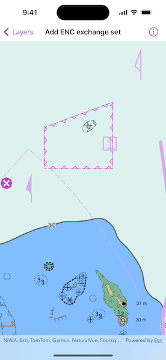

# Add ENC exchange set
Display nautical charts per the ENC specification.

## Use case
The [ENC specification](https://docs.iho.int/iho_pubs/standard/S-57Ed3.1/20ApB1.pdf) describes how hydrographic data should be displayed digitally.

An ENC exchange set is a catalog of data files which can be loaded as cells. The cells contain information on how symbols should be displayed in relation to one another, so as to represent information such as depth and obstacles accurately.

## How to use the sample
Run the sample and view the ENC data. Pan and zoom around the map. Take note of the high level of detail in the data and the smooth rendering of the layer.

## How it works
1. Specify the path to a local CATALOG.031 file to create an `EncExchangeSet`.
2. After loading the exchange set, get the `EncDataset` objects in the exchange set with `getDatasets()`.
3. Create an `EncCell` for each dataset. Then create an `EncLayer` for each cell.
4. Add the ENC layer to a map's operational layers collection to display it.

## Relevant API
* EncCell
* EncDataset
* EncExchangeSet
* EncLayer

## Offline data
This sample downloads the [ENC Exchange Set without updates](https://www.arcgis.com/home/item.html?id=9d2987a825c646468b3ce7512fb76e2d) item from ArcGIS Online.

## Tags
data, ENC, hydrographic, layers, maritime, nautical chart
