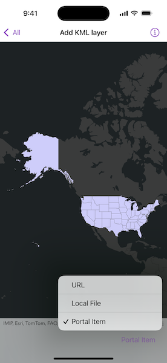

# Add KML layer

Display KML from a URL, portal item, or local KML file.

## Use case

Keyhole Markup Language (KML) is a data format used by Google Earth. KML is popular as a transmission format for consumer use and for sharing geographic data between apps. You can use the Maps SDKs to display KML files, with full support for a variety of features, including network links, 3D models, screen overlays, and tours.

## How to use the sample

Use the picker to select a source. A KML layer created from that source will then be displayed in the map.

## How it works

1. To create a KML layer from a URL, create a `KMLDataset` with the URL to the KML file. Then, create a `KMLLayer` using the dataset.
2. To create a KML layer from a portal item, create a `PortalItem` with a `Portal` and the KML portal item ID. Then, create a `KMLLayer` using the portal item.
3. To create a KML layer from a local file, create a `KMLDataset` using the absolute file path to the local KML file. Then, create a `KMLLayer` using the dataset.
4. Add the layer to the map with `addOperationalLayer(_:)`.

## Relevant API

* KMLDataset
* KMLLayer

## Offline data

This sample uses the [US State Capitals](https://www.arcgis.com/home/item.html?id=324e4742820e46cfbe5029ff2c32cb1f) KML file. It is downloaded from ArcGIS Online automatically.

## About the data

This sample displays three different KML files:

* From URL: This is a map of the significant weather outlook produced by NOAA/NWS. It uses KML network links to always show the latest data.
* From local file: This is a map of U.S. state capitals. It doesn't define an icon, so the default pushpin is used for the points.
* From portal item: This is a map of U.S. states.

## Tags

keyhole, KML, KMZ, OGC
