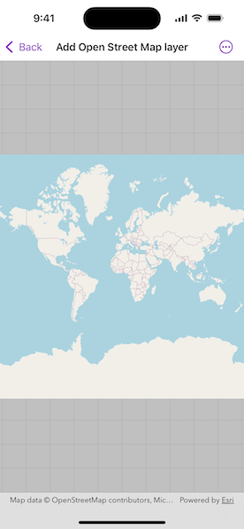

# Add OpenStreetMap layer

Add an OpenStreetMap basemap.

## Use case

[OpenStreetMap](https://www.openstreetmap.org) is a free community-edited basemap.

## How to use the sample

When the sample opens, it will automatically display the map with the OpenStreetMap standard basemap style. Pan and zoom to observe the basemap.

## How it works

1. Create a map with the OSM basemap style.
2. Show the map in a map view.

## Relevant API

* Basemap.Style
* Map
* MapView

## Additional information

The attribution text will be set to the required OpenStreetMap attribution automatically.

## Tags

basemap, layers, map, open, OpenStreetMap, OSM, street
