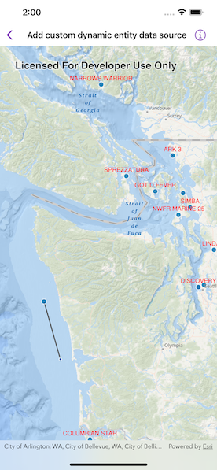

# Add custom dynamic entity data source

Create a custom dynamic entity data source and display it using a dynamic entity layer.

## Use case

Developers can create a `CustomDynamicEntityDataSource` to be able to visualize data from a variety of different feeds as dynamic entities using a `DynamicEntityLayer`. An example of this is in a mobile situational awareness app, where `CustomDynamicEntityDataSource` can be used to connect to peer-to-peer feeds in order to visualize real-time location tracks from teammates in the field.

## How to use the sample

Run the sample to view the map and the dynamic entity layer displaying the latest observation from the custom data source. Tap on a dynamic entity to view its attributes in a callout.

## How it works

1. Create the metadata for the data source using `DynamicEntityDataSourceInfo` for a given unique entity ID field and an array of `Field` objects matching the fields in the data source.
2. Create your custom feed type that conforms to `CustomDynamicEntityFeed` which will implement the data feed that will asynchronously emit `CustomDynamicEntityFeedEvent`.
3. The feed should loop through the observations JSON and deserialize each observation into a `Point` object and a `Dictionary<String, Any>` containing the attributes.
4. Use `CustomDynamicEntityFeedEvent.newObservation(geometry:attributes:)` to add each event to the feed.
5. Create a custom data source using `CustomDynamicEntityDataSource`.

## Relevant API

* CustomDynamicEntityDataSource
* CustomDynamicEntityFeed
* CustomDynamicEntityFeedEvent
* DynamicEntity
* DynamicEntityDataSource
* DynamicEntityLayer
* LabelDefinition
* TrackDisplayProperties

## About the data

This sample uses a [JSON Lines file containing observations of marine vessels in the Pacific North West](https://www.arcgis.com/home/item.html?id=a8a942c228af4fac96baa78ad60f511f) hosted on ArcGIS Online.

## Tags

data, dynamic, entity, label, labeling, live, real-time, stream, track
