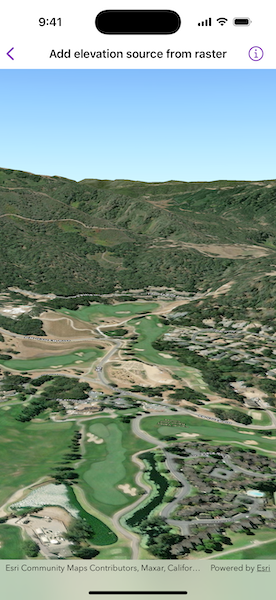

# Add elevation source from raster

Set the terrain surface with elevation described by a raster file.

## Use case

In a scene view, the terrain surface is what the basemap, operational layers, and graphics are draped onto. For example, when viewing a scene in a mountainous region, applying a terrain surface to the scene will help in recognizing the slopes, valleys, and elevated areas.

## How to use the sample

When opened, the sample displays a scene with a terrain surface applied. Pan and zoom to explore the scene and observe how the terrain surface allows visualizing elevation differences.

## How it works

1. Create a `Scene` and add it to a `SceneView`.
2. Create a `RasterElevationSource` with an array of raster file URLs.
3. Add the source to the scene's base surface.

## Relevant API

* RasterElevationSource
* Surface

## Offline data

This sample uses the [MontereyElevation](https://arcgisruntime.maps.arcgis.com/home/item.html?id=98092369c4ae4d549bbbd45dba993ebc) raster. It is downloaded from ArcGIS Online automatically.

## Additional information

 Supported raster formats include:

* ASRP/USRP
* CIB1, 5, 10
* DTED0, 1, 2
* GeoTIFF
* HFA
* HRE
* IMG
* JPEG
* JPEG 2000
* NITF
* PNG
* RPF
* SRTM1, 2

## Tags

3D, elevation, raster, surface, terrain
