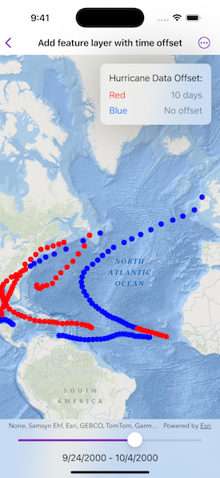

# Add feature layer with time offset

Display a time-enabled feature layer with a time offset.

## Use case

You can use a time offset to compare time periods by displaying them overlaid on the map. For example, you could show a feature layer with flu cases from December overlaid with flu cases from January to visualize the spread of the disease over time.

## How to use the sample

When the sample loads, you'll see hurricane tracks visualized in red and blue. The red hurricane tracks occurred 10 days before the tracks displayed in blue. Adjust the slider to move the interval to visualize how storms progress over time.

## How it works

1. Create a feature layer for displaying the non-offset features and apply symbology to it.
2. Create a second feature layer referring to the same service. Apply a 10 day time offset and unique symbology. Features displayed from this layer will have time values 10 days earlier than the values in the non-offset layer.
3. Apply a 10-day time extent to the map view, starting at the beginning of the data range.
4. When the user adjusts the slider, move the time extent. Both feature layers will filter their content for the map view's time extent.

## Relevant API

* FeatureLayer
* MapView
* TimeExtent

## About the data

The sample uses a time-enabled feature service depicting [hurricanes in the year 2000](https://sampleserver6.arcgisonline.com/arcgis/rest/services/Hurricanes/MapServer/0).

## Tags

change, range, time, time extent, time offset, time-aware, time-enabled
