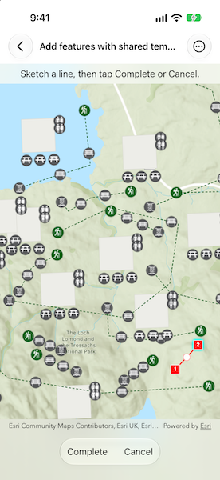

# Add features with shared templates

Create features from preset and group shared templates.

## Use case

Preset and group shared templates support guided, repeatable, high-quality editing. Preset templates place predefined feature arrangements, while group templates create feature sets relative to a user-defined base geometry. By automatically applying attributes, symbology, geometry settings, and feature relationships or associations, they help field staff create consistent, fully configured assets with only a few choices.

## How to use the sample

Open "Shared Templates" and select a template. When using a pointer, hover over a template to view its description. Tap on the map to place a point, or tap multiple positions to sketch a line. Once the sketch is valid, choose "Complete" to create features locally, or choose "Cancel" to discard the sketch. Choose "Save" to send the local edits to the service, or "Undo" to discard all local edits.

## How it works

1. Create a `Map` from a web map portal item and load it.
2. Inspect the map's operational layers for a `FeatureLayer` backed by a `ServiceFeatureTable`, then get its `ServiceGeodatabase`, which conforms to `SharedTemplateSource`.
3. Call `querySharedTemplates(using:)` with its default query parameters to return all shared templates for all layers. Visit the layers in layer ID order and select the first preset and group templates encountered, displaying up to one of each kind. Store each selected template's layer ID and display its name, kind, description, and swatch.
4. Call `makeSwatch(layerID:)` to generate each template's swatch image, falling back to a default image when a swatch is unavailable.
5. Call `defaultConstructionTool(forLayerWithID:)` and use the `GeometryConstructionTool.Kind` to start a `GeometryEditor` with either a point or polyline geometry type.
6. After the user selects "Complete", call `stop()` on the geometry editor. Pass the returned geometry to `makeFeatures(sharedTemplate:geometry:)` to create an in-memory `SharedTemplateFeatureCreationSet` with default geometries and attributes.
7. Call `addFeatures(using:)` to add the feature creation set to the geodatabase locally.
8. Select "Save" to apply local edits using `applyEdits()`, or select "Undo" to discard them using `undoLocalEdits()`.

## Relevant API

* GeometryConstructionTool
* GeometryEditor
* ServiceGeodatabase
* SharedTemplate
* SharedTemplateFeatureCreationSet
* SharedTemplateQueryParameters
* SharedTemplateSource

## About the data

The sample uses the [Parks and Grounds Assets](https://www.maps.arcgis.com/home/item.html?id=b635be46dfb545b888077389ac7f0962) web map.

## Tags

edit, feature, group, preset, shared template, shared template source, template
