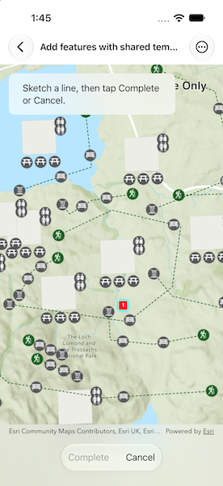

# Add features with shared templates

Create features from preset and group shared templates.

## Use case

Preset and group shared templates support guided, repeatable, high-quality editing. Preset templates place predefined feature arrangements, while group templates create feature sets relative to a user-defined base geometry. By automatically applying attributes, symbology, geometry settings, and feature relationships or associations, they help field staff create consistent, fully configured assets with only a few choices.

## How to use the sample

Open "Shared Templates" and select a template. When using a pointer, hover over a template to view its description. Tap on the map to place a point, or tap multiple positions to sketch a line. Once the sketch is valid, choose "Complete" to create features locally. Choose "Cancel" at any time while drawing to discard the sketch. Choose "Save" to send the local edits to the service, or "Undo" to discard all local edits. Resolve any pending local edits before selecting another template.

## How it works

1. Create a `Map` from a web map portal item and load it.
2. Get the first available `ServiceGeodatabase` from the map's operational `FeatureLayer` objects backed by `ServiceFeatureTable` objects.
3. Call `querySharedTemplates()` without explicit query parameters. Visit the returned layers in ascending layer ID order and select the first preset and first group template encountered, displaying at most one of each kind overall. Store each selected template's layer ID and display its name, kind, and swatch, with its description available as help text.
4. Call `makeSwatch(layerID:)` to generate each template's swatch image, falling back to a default image when a swatch is unavailable.
5. Call the selected template's `defaultConstructionTool(forLayerWithID:)`. Set the `GeometryEditor` tool to a `VertexTool`, then start the editor with `Point.self` for a `.point` construction tool kind or `Polyline.self` for `.line`. Report an error if the construction tool is unavailable or has an unsupported kind.
6. After the user selects "Complete", verify that the geometry editor is started, capture its `geometry`, and check that the geometry's `sketchIsValid` is true. Call `stop()`, then pass the captured geometry to `makeFeatures(sharedTemplate:geometry:)` to create a feature creation set.
7. Call `addFeatures(using:)` to add the feature creation set to the geodatabase locally.
8. Select "Save" to apply local edits using `applyEdits()`, or select "Undo" to discard them using `undoLocalEdits()`.

## Relevant API

* GeometryConstructionTool
* GeometryEditor
* ServiceGeodatabase
* SharedTemplate
* SharedTemplateFeatureCreationSet
* SharedTemplateQueryParameters
* SharedTemplateSource
* VertexTool

## About the data

The sample uses the [Parks and Grounds Assets](https://www.maps.arcgis.com/home/item.html?id=b635be46dfb545b888077389ac7f0962) web map.

## Tags

edit, feature, group, preset, shared template, shared template source, template
