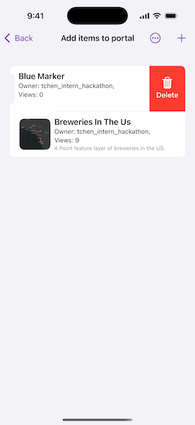

# Add items to portal

This sample demonstrates how to add and delete items in a user's portal.

## Use case

Portals allow you to share and publish data with others. For example, you may create or collect some data on your device and want to upload that to a cloud storage location to share with others or simply save for later use. In this case, a file is uploaded to ArcGIS Online.

## How to use the sample

Sign into your ArcGIS Online account. After signed in, press the Add Item button, and this will add a file to your `Portal`. Tap the portal item to reveal an alert to delete an item.

## How it works

1. A `Portal` is created with `authenticated` connection. The `Portal` is loaded and the OAuth sign in page is displayed. The user provides credentials.
2. Once the sign-in process is complete, and the portal is successfully loaded, the `PortalUser` object is obtained from the `Portal`.
3. When the add button is tapped, the item is added via the `PortalUser`'s `add(_:with:to:)` method. The `PortalItem` and the file data are supplied as parameters.
4. When the portal item has been successfully added, it is loaded in order to retrieve online properties such as the the name and thumbnail of the item.
5. When the swipe-to-delete button is tapped, the item is passed as a parameter for the portalUser's `delete(_:)` method.

## Relevant API

* ArcGISEnvironment
* OAuthUserConfiguration
* Portal
* PortalItem

## Tags

add item, cloud, portal
