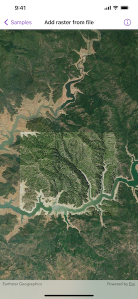

# Add raster from file

Create and use a raster layer made from a local raster file.

## Use case

Rasters can be digital aerial photographs, imagery from satellites, digital pictures, or even scanned maps. An end-user will frequently need to import raster files acquired through various data-collection methods into their map to view and analyze the data.

## How to use the sample

Upon launch, a raster will be loaded from a file and displayed in the map view. Pan and zoom to explore.

## How it works

1. Create a `Raster` from a raster file.
2. Create a `RasterLayer` from the raster.
3. Add the raster layer to the map's operational layers.

## Relevant API

* Raster
* RasterLayer

## About the data

This sample shows a [Shasta Raster](https://www.arcgis.com/home/item.html?id=7c4c679ab06a4df19dc497f577f111bd) hosted on ArcGIS Online.

## Additional information

See the topic [What is raster data?](https://desktop.arcgis.com/en/arcmap/latest/manage-data/raster-and-images/what-is-raster-data.htm) in the *ArcMap* documentation for more information about raster images.

## Tags

data, image, import, layer, raster, visualization
