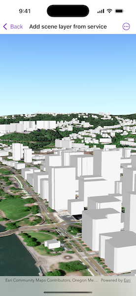

# Add scene layer from service

Display an ArcGIS scene layer from a service.

## Use case

Adding a scene layer from a service allows you to author the scene layer elsewhere in the platform, say with ArcGIS Pro or CityEngine, and then add that scene layer to a scene in ArcGIS Maps SDK. Loading a scene layer from a service also permits the layer source to change dynamically without updating the code.

## How to use the sample

Pan and zoom to explore the scene.

## How it works

1. Create a `Scene` object with a topographic basemap style.
2. Create a `Surface` object and add an `ArcGISTiledElevationSource` to it.
3. Set the surface to the scene's base surface.
4. Create an `ArcGISSceneLayer` with a URL and add it to the scene's operational layers.
5. Create a `SceneView` with the scene.

## Relevant API

* ArcGISSceneLayer
* Scene
* SceneView

## About the data

This sample shows a [Brest, France Scene](https://tiles.arcgis.com/tiles/P3ePLMYs2RVChkJx/arcgis/rest/services/Buildings_Brest/SceneServer/layers/0) hosted on ArcGIS Online.

## Tags

3D, buildings, model, scene, service, URL
