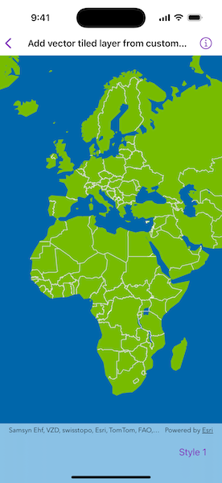
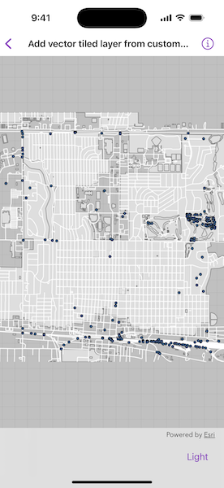

# Add vector tiled layer from custom style

Load an ArcGIS vector tiled layers using custom styles.

## Use case

Vector tile basemaps can be created in ArcGIS Pro and published as offline packages or online services. You can create a custom style tailored to your needs and easily apply them to your map. `ArcGISVectorTiledLayer` has many advantages over traditional raster based basemaps (`ArcGISTiledLayer`), including smooth scaling between different screen DPIs, smaller package sizes, and the ability to rotate symbols and labels dynamically.

## How to use the sample

Pan and zoom to explore the vector tile basemap. Select a theme to see it applied to the vector tile basemap.

## How it works

1. Create an `ArcGISVectorTiledLayer` with the URL of a custom style from AcrGIS Online.
2. Alternatively, create an `ArcGISVectorTiledLayer` by taking a portal item offline and applying it to an offline vector tile package:
    i. Create a `PortalItem` using the URL of a custom style.  
    ii. Create an `ExportVectorTilesTask` using the portal item.  
    iii. Get the `ExportVectorTilesJob` using `ExportVectorTilesTask.makeExportStyleResourceCacheJob(itemResourceCacheURL:)`.  
    iv. Start the job using  `Job.start()`.  
    v. Create a `VectorTileCache` using the path of the local vector tile package.  
    vi. Once the job is complete, create an `ArcGISVectorTiledLayer` using the vector tile cache and the `ItemResourceCache` from the job's result.  
3. Create a `Basemap` from the `ArcGISVectorTiledLayer`.
4. Assign the basemap to the map's `basemap`.

## Relevant API

* ArcGISVectorTiledLayer
* ExportVectorTilesTask
* ItemResourceCache
* Map
* VectorTileCache

## Offline data

This sample uses the [Dodge City OSM](https://www.arcgis.com/home/item.html?id=f4b742a57af344988b02227e2824ca5f) vector tile package. It is downloaded from ArcGIS Online automatically.

## Tags

tiles, vector, vector basemap, vector tile package, vector tiled layer, vector tiles, vtpk
