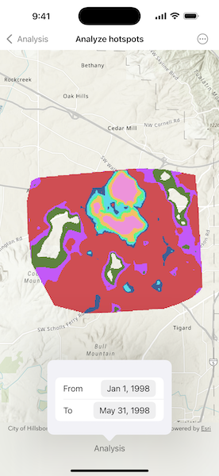

# Analyze hotspots

Use a geoprocessing service and a set of features to identify statistically significant hot spots and cold spots.

## Use case

This tool identifies statistically significant spatial clusters of high values (hot spots) and low values (cold spots). For example, a hotspot analysis based on the frequency of 911 calls within a set region.

## How to use the sample

Select a date range (between 1998-01-01 and 1998-05-31) from the dialog. The results will be shown on the map upon successful completion of the geoprocessing job.

## How it works

1. Create a geoprocessing task with the URL set to the endpoint of a geoprocessing service using `GeoprocessingTask.init(url:)`.
2. Create a query string with the date range and set it as an input of the geoprocessing parameters using `GeoprocessingParameters.setInputValue(_:forKey:)`.
3. Use the geoprocessing task to create a job with the parameters using `GeoprocessingTask.makeJob(parameters:)`.
4. Start the geoprocessing job and wait for it to complete and return a result using `GeoprocessingJob.output`.
5. Get the resulting `ArcGISMapImageLayer` instance using `GeoprocessingResult.mapImageLayer`.
6. Add the layer to the map's operational layers.

## Relevant API

* GeoprocessingJob
* GeoprocessingParameters
* GeoprocessingResult
* GeoprocessingTask

## Tags

analysis, density, geoprocessing, hot spots, hotspots
