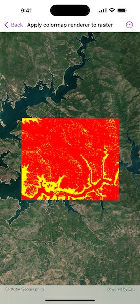

# Apply colormap renderer to raster

Apply a colormap renderer to a raster.

## Use case

A colormap renderer transforms pixel values in a raster to display raster data based on specific colors, aiding in visual analysis of the data. For example, a forestry commission may want to quickly visualize areas above and below the tree-line line occurring at a know elevation on a raster containing elevation values. They could overlay a transparent colormap set to color those areas below the tree-line elevation green, and those above white.

## How to use the sample

Pan and zoom to explore the effect of the colormap applied to the raster.

## How it works

1. Create a raster from a raster file using `Raster.init(name:extension:bundle:)`.
2. Create a raster layer with the raster using `RasterLayer.init(raster:)`.
3. Create an array of colors. Colors at the beginning of the array replace the darkest values in the raster and colors at the end of the array replace the brightest values of the raster.
4. Create a colormap renderer with the color array using `ColormapRenderer.init(colors:)`, and assign it to the raster layer using `RasterLayer.renderer`.

## Relevant API

* ColormapRenderer
* Raster
* RasterLayer

## Offline data

This sample uses the [ShastaBW](https://www.arcgis.com/home/item.html?id=cc68728b5904403ba637e1f1cd2995ae) raster. It is downloaded from ArcGIS Online automatically.

## About the data

The raster used in this sample shows an area in the south of the Shasta-Trinity National Forest, California.

## Tags

colormap, data, raster, renderer, visualization
