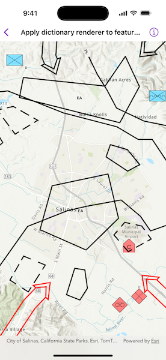

# Apply dictionary renderer to feature layer

Convert features into graphics to show them with mil2525d symbols.

## Use case

A dictionary renderer uses a style file and a rule engine to display advanced symbology. This is useful for displaying features using precise military symbology.

## How to use the sample

Pan and zoom around the map. Observe the displayed military symbology on the map.

## How it works

1. Create and load a `Geodatabase` using a local ".geodatabase" file.
2. Create and load a `DictionarySymbolStyle` using a style file.
3. Create a `FeatureLayer` for each of the geodatabase's `featureTables`.
4. Create a `DictionaryRenderer` using the dictionary symbol style and assign it to the feature layer's `renderer`.
5. Add the feature layers to the map using `addOperationalLayers(_:)`.
6. Load the feature layers and create a new `Envelope` from a union of the extents of all layers.
7. Use the envelope to create a viewpoint and pass it to the map view.

## Relevant API

* DictionaryRenderer
* DictionarySymbolStyle

## Offline data

This sample uses the [Joint Military Symbology MIL-STD-2525D style file](https://www.arcgis.com/home/item.html?id=e34835bf5ec5430da7cf16bb8c0b075c) and the [Military Overlay geodatabase](https://www.arcgis.com/home/item.html?id=e0d41b4b409a49a5a7ba11939d8535dc). Both are downloaded from ArcGIS Online automatically.

## Tags

military, symbol
