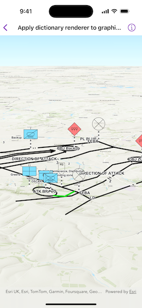

# Apply dictionary renderer to graphics overlay

Create graphics from an XML file with key-value pairs for each graphic and display the military symbols using a MIL-STD-2525D web style in 3D.

## Use case

Use a dictionary renderer on a graphics overlay to display more transient data, such as military messages coming through a local tactical network.

## How to use the sample

Open the sample and view the military symbols on the scene.

## How it works

1. Create a new `DictionarySymbolStyle` object with a protal item and set the style's draw rule configuration to "ORDERED ANCHOR POINTS".
2. Create a new `DictionaryRenderer` object with the dictionary symbol style.
3. Create an instance of `GraphicsOverlay`.
4. Set the dictionary renderer to the graphics overlay's `renderer`.
5. Parse the local XML file, creating a map of key/value pairs for each block of attributes.
6. Create an instance of `Graphic` for each attribute.
7. Use the `_wkid` key to get the geometry's spatial reference.
8. Use the `_control_points` key to get the geometry's shape.
9. Add the graphics to the graphics overlay.

## Relevant API

* DictionaryRenderer
* DictionarySymbolStyle
* GraphicsOverlay

## About the data

The sample uses the [Joint Military Symbology MIL-STD-2525D dictionary style](https://arcgis.com/home/item.html?id=d815f3bdf6e6452bb8fd153b654c94ca) from ArcGIS Online. This ArcGIS Web Style is for use to build custom applications that incorporate the MIL-STD-2525D symbol dictionary. This style supports a configuration for modeling locations as ordered anchor points or full geometries.

A local XML file containing messages with MIL-STD-2525D fields for military symbology ([MIL-STD-2525D Messages 100.13.0](https://www.arcgis.com/home/item.html?id=8776cfc26eed4485a03de6316826384c)) is also used. This is downloaded from ArcGIS Online automatically.

## Tags

defense, military, situational awareness, tactical, visualization
