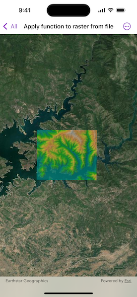

# Apply function to raster from file

Apply a raster function to a local raster file and display the output with a raster layer.

## Use case

Raster functions allow processing operations that can be applied to one or more rasters on the fly. A land survey agency may apply hillshade and aspect functions to rasters with elevation data in order to better determine the topography of a landscape and to make further planning decisions.

## How to use the sample

Load the sample to see a raster function applied to a raster.

## How it works

1. Create a `RasterFunction` using the path to a local raster function JSON file.
2. Set the raster function arguments as required by the function used.
3. Use the raster function to create a new `Raster`.
4. Set the raster to a `RasterLayer` and display it in the `Map`.

## Relevant API

* Raster
* RasterFunction
* RasterLayer

## Offline data

This sample uses the [Shasta Elevation Raster](https://www.arcgis.com/home/item.html?id=b051f5c3e01048f3bf11c59b41507896) and [Color Raster Function](https://www.arcgis.com/home/item.html?id=5356dbf91788474493467519e268cf87). Both are downloaded from ArcGIS Online automatically.

## About the data

The raster function in the provided JSON file blends a color image with a greyscale image (in this case, a raster image containing elevation data), to add a hillshade effect to the input raster.

## Additional information

Learn more about [raster functions](https://pro.arcgis.com/en/pro-app/latest/help/analysis/raster-functions/raster-functions.htm) in the ArcGIS Pro documentation.

## Tags

analysis, function, image, layer, processing, raster, raster function, transformation
