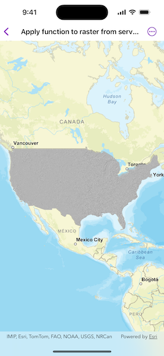

# Apply function to raster from service

Load a raster from a service, then apply a function to it.

## Use case

Raster functions allow processing operations that can be applied to one or more rasters on the fly. Functions can be applied to rasters that come from a service. A land survey agency may apply hillshade and aspect functions to rasters with elevation data in order to better determine the topography of a landscape and to make further planning decisions.

## How to use the sample

The raster function is applied automatically when the sample starts and the result is displayed.

## How it works

1. Create the `ImageServiceRaster` referring to the image server URL.
2. Create the `RasterFunction` from a JSON string.
3. Get the name of the raster argument to the function with `rasterFunction.arguments!.rasterNames[0]`.
4. Set the raster argument with `setRaster(_:forArgumentNamed:)`.
5. Create a new `Raster` referring to the raster function.
6. Create a `RasterLayer` to visualize the computed raster.
7. Display the raster.

## Relevant API

* ImageServiceRaster
* Raster
* RasterFunction
* RasterFunctionArguments
* RasterLayer

## About the data

The sample applies a hillshade function to a raster produced from the National Land Cover Database, [NLCDLandCover2001](https://sampleserver6.arcgisonline.com/arcgis/rest/services/NLCDLandCover2001/ImageServer). You can learn more about the [hillshade function](https://pro.arcgis.com/en/pro-app/latest/help/analysis/raster-functions/hillshade-function.htm) in the *ArcGIS Pro* documentation.

## Additional information

The raster function computation happens locally on the client device.

## Tags

function, layer, raster, raster function, service
