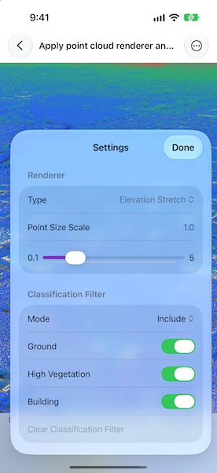

# Apply point cloud renderer and filter

Visualize point cloud data using different renderers and filters.

## Use case

Point clouds contain large collections of 3D points captured by sensors such as lidar. Each point can include attributes that describe its color, elevation, classification, return, and other properties. Applying renderers and filters to these attributes can reveal patterns in the data and isolate points of interest, such as buildings or vegetation.

## How to use the sample

The sample initially displays a point cloud layer using its RGB values. Once the layer loads, open Settings and select a renderer to visualize the points by RGB color, elevation, or LAS classification code.

Use the Point Size Scale control to increase or decrease the size of the rendered points. The value is a multiplier that modifies the renderer's splat algorithm `scaleFactor`, not a fixed size in pixels or map units.

Use the filter controls to include or exclude classification codes, select lidar return types, and require scan direction flag bit 6 to be set or clear. Multiple filters can be applied at the same time. To remove a filter without affecting the others, select Clear Classification Filter, turn off all return switches, or select Any scan direction.

With no classification filter, all Include switches are on and all Exclude switches are off. Switching modes inverts the selections to preserve which listed classification codes are allowed. Clearing the classification filter restores these unrestricted switch states for the current mode.

Once a classification filter is applied, Include with no selected codes hides all points, while Exclude with no selected codes allows all classifications. No selected return types allows all returns, and Any scan direction removes that restriction. Other active filters still apply.

The Last return type includes both Last of Many and Single. Selecting either alongside Last does not include additional points.

## How it works

1. Create a `PointCloudLayer` with the Sonoma Area 1 point cloud scene layer URL and add it to a scene's operational layers. Create the scene with `Scene(viewingMode: .local, basemapStyle: .arcGISImagery)` and display it in a `LocalSceneView`. Custom point cloud renderers and filters require `LocalSceneView`, rather than `SceneView`.
2. Create the following point cloud renderers:
   * Create a `PointCloudRGBRenderer` using the `RGB` attribute.
   * Create a `PointCloudStretchRenderer` using the `ELEVATION` attribute and three `PointCloudColorStop` objects with fixed example elevation values of 0, 30, and 90.
   * Create a `PointCloudClassBreaksRenderer` using the `ELEVATION` attribute and three `PointCloudColorClassBreak` objects with fixed example elevation ranges from `-Double(Float.greatestFiniteMagnitude)` to 20, 20 to 40, and 40 to `Double(Float.greatestFiniteMagnitude)`. The large finite outer bounds accommodate elevations outside the example thresholds, including negative elevations.
   * Create a `PointCloudUniqueValueRenderer` using the `CLASS_CODE` attribute and `PointCloudColorUniqueValue` objects for classification values 1 through 18. Although the attribute is numeric, `PointCloudColorUniqueValue` accepts these values as strings.
3. Set a `PointCloudSplatAlgorithm` on each renderer and set the renderer's `pointsPerInch` property to `25`. Modify the active renderer's existing splat algorithm to update its `scaleFactor`.
4. Set the selected renderer on the point cloud layer's `renderer` property. The `PointCloudRGBRenderer` we constructed is applied initially.
5. Create the following point cloud filters:
   * Create a `PointCloudValueFilter` using the `CLASS_CODE` attribute, the selected classification values as `Double` values, and the selected include or exclude mode.
   * Create a `PointCloudReturnFilter` using the `RETURNS` attribute and the selected return types.
   * Create a `PointCloudBitfieldFilter` using the `FLAGS` attribute and require scan direction bit 6 to be either set or clear. The required-bit collections contain zero-based bit positions, not bit masks.
6. Add, update, or remove each filter independently in the point cloud layer's `filters` collection as its selections change. The collection is initially empty. Remove the return filter when no return types are selected; an empty `PointCloudReturnFilter` would otherwise hide all points. Switching renderers leaves the filters unchanged.

## Relevant API

* LocalSceneView
* PointCloudBitfieldFilter
* PointCloudClassBreaksRenderer
* PointCloudColorClassBreak
* PointCloudColorStop
* PointCloudColorUniqueValue
* PointCloudLayer
* PointCloudReturnFilter
* PointCloudRGBRenderer
* PointCloudSplatAlgorithm
* PointCloudStretchRenderer
* PointCloudUniqueValueRenderer
* PointCloudValueFilter

## About the data

This sample uses the [Sonoma Area 1 LiDAR RGB point cloud scene layer](https://www.arcgis.com/home/item.html?id=bc963a0adfd7450d8cc11b58510fda8d#overview). The layer provides the `RGB`, `ELEVATION`, `CLASS_CODE`, `RETURNS`, and `FLAGS` attributes used by the renderers and filters.

## Tags

3D, classification, filter, lidar, point cloud, renderer, scene layer, visualization
