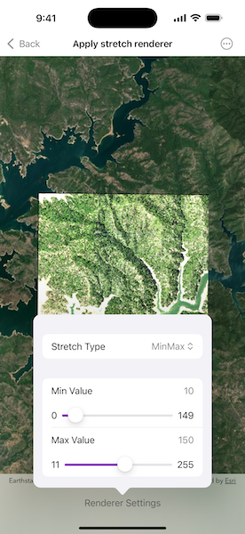

# Apply stretch renderer

Use a stretch renderer to enhance the visual contrast of raster data for analysis.

## Use case

An appropriate stretch renderer can enhance the contrast of raster imagery, allowing the user to control how their data is displayed for efficient imagery analysis.

## How to use the sample

Choose one of the stretch parameter types:

* Standard deviation - a linear stretch defined by the standard deviation of the pixel values
* Min-max - a linear stretch based on minimum and maximum pixel values
* Percent clip - a linear stretch between the defined percent clip minimum and percent clip maximum pixel values

Then configure the parameters.

## How it works

1. Create a raster from a raster file using `Raster.init(fileURL:)`.
2. Create a raster layer from the raster using `RasterLayer.init(raster:)`.
3. Add the layer to the map using `Map.addOperationalLayer(_:)`.
4. Create a stretch renderer, specifying the stretch parameters and other properties using `StretchRenderer.init(parameters:gammas:estimatesStatistics:colorRamp:)`.
5. Set the renderer on the raster layer using `RasterLayer.renderer`.

## Relevant API

* ColorRamp
* MinMaxStretchParameters
* PercentClipStretchParameters
* Raster
* RasterLayer
* StandardDeviationStretchParameters
* StretchParameters
* StretchRenderer

## Offline data

This sample uses the [Shasta](https://arcgisruntime.maps.arcgis.com/home/item.html?id=7c4c679ab06a4df19dc497f577f111bd) raster. It is downloaded from ArcGIS Online automatically.

## About the data

This sample uses a raster imagery tile of an area of forested mountainous terrain and rivers.

## Additional information

See [Stretch function](https://pro.arcgis.com/en/pro-app/latest/help/analysis/raster-functions/stretch-function.htm) in the *ArcGIS Pro* documentation for more information about the types of stretches that can be performed.

## Tags

analysis, deviation, histogram, imagery, interpretation, min-max, percent clip, pixel, raster, stretch, symbology, visualization
