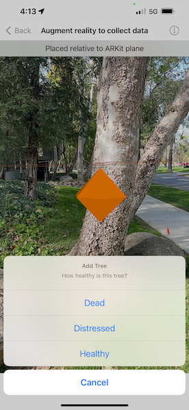

# Augment reality to collect data

Tap on real-world objects to collect data.

## Use case

You can use AR to quickly photograph an object and automatically determine the object's real-world location, facilitating a more efficient data collection workflow. For example, you could quickly catalog trees in a park, while maintaining visual context of which trees have been recorded - no need for spray paint or tape.

## How to use the sample

Before you start, go through the on-screen calibration process to ensure accurate positioning of recorded features.

When you tap, an orange diamond will appear at the tapped location. You can move around to visually verify that the tapped point is in the correct physical location. When you're satisfied, tap the '+' button to record the feature.

## How it works

1. Create the `WorldScaleSceneView` and add it to the view.
2. Load the feature service and display it with a feature layer.
3. Create and add the elevation surface to the scene.
4. Create a graphics overlay for planning the location of features to add. Configure the graphics overlay with a renderer and add the graphics overlay to the scene view.
5. When the user taps the screen, use `WorldScaleSceneView.onSingleTapGesture(perform:)` to find the real-world location of the tapped object using ARKit plane detection.
6. Add a graphic to the graphics overlay preview where the feature will be placed and allow the user to visually verify the placement.
7. Prompt the user for a tree health value, then create the feature.

## Relevant API

* GraphicsOverlay
* SceneView
* Surface
* WorldScaleSceneView

## About the data

The sample uses a publicly-editable sample tree survey feature service hosted on ArcGIS Online called [AR Tree Survey](https://arcgisruntime.maps.arcgis.com/home/item.html?id=8feb9ea6a27f48b58b3faf04e0e303ed). You can use AR to quickly record the location and health of a tree.

## Additional information

There are two main approaches for identifying the physical location of tapped point:

* **WorldScaleSceneView.onSingleTapGesture** - uses plane detection provided by ARKit to determine where _in the real world_ the tapped point is.
* **SceneView.onSingleTapGesture** - determines where the tapped point is _in the virtual scene_. This is problematic when the opacity is set to 0 and you can't see where on the scene that is. Real-world objects aren't accounted for by the scene view's calculation to find the tapped location; for example tapping on a tree might result in a point on the basemap many meters away behind the tree.

This sample only uses the `WorldScaleSceneView.onSingleTapGesture` approach, as it is the only way to get accurate positions for features not directly on the ground in real-scale AR.

Note that unlike other scene samples, a basemap isn't shown most of the time, because the real world provides the context. Only while calibrating is the basemap displayed at 50% opacity, to give the user a visual reference to compare to.

**World-scale AR** is one of three main patterns for working with geographic information in augmented reality. Augmented reality is made possible with the ArcGIS Maps SDK for Swift Toolkit. See [Augmented reality](https://developers.arcgis.com/swift/scenes-3d/display-scenes-in-augmented-reality/) in the guide for more information about augmented reality and adding it to your app.

See the 'Edit feature attachments' sample for more specific information about the attachment editing workflow.

## Tags

attachment, augmented reality, capture, collection, collector, data, field, field worker, full-scale, mixed reality, survey, world-scale
