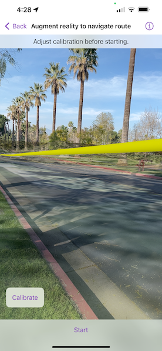

# Augment reality to navigate route

Use a route displayed in the real world to navigate.

## Use case

It can be hard to navigate using 2D maps in unfamiliar environments. You can use full-scale AR to show a route overlaid on the real-world for easier navigation.

## How to use the sample

The sample opens with a map centered on the current location. Tap the map to add an origin and a destination; the route will be shown as a line.

When ready, tap the camera button to start the AR navigation. Calibrate the heading before starting to navigate.

When you start, route instructions will be displayed and spoken. As you proceed through the route, new directions will be provided until you arrive.

## How it works

1. The map page is used to plan the route before starting the AR experience. See *Navigate route*, *Find route*, and *Offline routing* samples for a more focused demonstration of that workflow.
2. Pass the resulting `RouteResult` and the input `RouteTask` and `RouteParameters` to the view used for the AR portion of the navigation experience.
    * The route task and parameters are used to support a rerouting capability where routes are recalculated on-the-fly if you deviate. Due to service limitations, this sample doesn't support on-the-fly rerouting. You can incorporate offline routing to support rerouting in your app.
3. Start ARKit/ARCore tracking with continuous location updates when the AR view is shown.
4. Get the route geometry from the first route in the `RouteResult`. Use the scene's base surface to apply elevation to the line so that it will follow the terrain.
    * First, densify the polyline to ensure that the elevation adjustment can be applied smoothly along the line with `GeometryEngine.densify(_:maxSegmentLength:)`
    * Next, create a polyline builder with a spatial reference matching the input route geometry
    * Get a list of all points in the polyline by iterating through parts and points along each part
    * For each point in the polyline, use `surface.elevation(for: point)` to get the elevation for that point. Then create a new point with the *x* and *y* of the input and *z* as the returned elevation value. This sample adds 3 meters to that value so that the route line is visible above the road. Add the new point to the polyline builder with `builder.add(newPoint)`
    * Once all points have been given an elevation and added to the polyline builder, call `toGeometry()` on the polyline builder to get the elevation-adjusted route line.
5. Add the route geometry to a graphics overlay and add a renderer to the graphics overlay. This sample uses a `MultilayerPolylineSymbol` with a `SolidStrokeSymbolLayer` to visualize a tube along the route line.
6. The `WorldScaleSceneView` has a calibration view that uses sliders to manipulate the heading (direction you are facing) and elevation. Because of limitations in on-device compasses, calibration is often necessary; small errors in heading cause big problems with the placement of scene content in the world.
    * The calibration view slider in the sample implements a 'joystick' interaction; the heading is adjusted faster the further you move from the center of the slider.
7. When the user starts navigating, create a `RouteTracker`, providing a `RouteResult` and the index of the route you want to use; this sample always picks the first returned result.
8. Create a location data source and listen for location change events. When the location changes, call `track(_:)` on the route tracker with the updated location.
9. Keep the calibration view accessible throughout the navigation experience. As the user walks, small heading errors may become more noticeable and require recalibration.

## Relevant API

* GeometryEngine
* LocationDataSource
* RouteResult
* RouteTask
* RouteTracker
* Surface
* WorldScaleSceneView

## About the data

This sample uses Esri's [world elevation service](https://elevation3d.arcgis.com/arcgis/rest/services/WorldElevation3D/Terrain3D/ImageServer) to ensure that route lines are placed appropriately in 3D space. It uses Esri's [world routing service](https://www.arcgis.com/home/item.html?id=1feb41652c5c4bd2ba5c60df2b4ea2c4) to calculate routes. The world routing service requires authentication and does consume ArcGIS Online credits.

## Additional information

This sample requires a device that is compatible with ARKit 1 on iOS.

Unlike other scene samples, there's no need for a basemap while navigating, because context is provided by the camera feed showing the real environment. The base surface's opacity is set to zero to prevent it from interfering with the AR experience.

A digital elevation model is used to ensure that the displayed route is positioned appropriately relative to the terrain of the route. If you don't want to display the route line floating, you could show the line draped on the surface instead.

**World-scale AR** is one of three main patterns for working with geographic information in augmented reality. Augmented reality is made possible with the ArcGIS Runtime Toolkit. See [Augmented reality](https://developers.arcgis.com/ios/scenes-3d/display-scenes-in-augmented-reality/) in the guide for more information about augmented reality and adding it to your app.

Because most navigation scenarios involve traveling beyond the accurate range for ARKit/ARCore positioning, this sample relies on **continuous location updates** from the location data source. Because the origin camera is constantly being reset by the location data source, the sample doesn't allow the user to pan to calibrate or adjust the altitude with a slider. The location data source doesn't provide a heading, so it isn't overwritten when the location refreshes.

## Tags

augmented reality, directions, full-scale, guidance, mixed reality, navigate, navigation, real-scale, route, routing, world-scale
