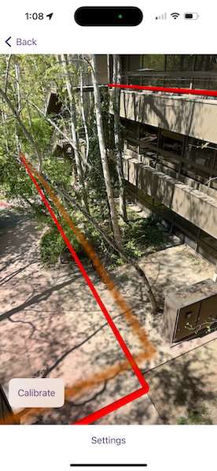

# Augment reality to show hidden infrastructure

Visualize hidden infrastructure in its real-world location using augmented reality.

## Use case

You can use AR to "x-ray" the ground to see pipes, wiring, or other infrastructure that isn't otherwise visible. For example, you could use this feature to trace the flow of water through a building to help identify the source of a leak.

## How to use the sample

When you open the sample, you'll see a map centered on your current location. Tap on the map to draw pipes around your location. After drawing the pipes, input an elevation value to place the drawn infrastructure above or below ground. When you are ready, tap the camera button to view the infrastructure you drew in AR.

## How it works

1. Draw pipes on the map. See the "Create and edit geometries" sample to learn how to use the geometry editor for creating graphics.
2. When you start the AR visualization experience, create and show the `WorldScaleSceneView`.
3. Pass a `SceneView` into the world scale scene view and set the space effect `transparent` and the atmosphere effect to `off`.
4. Create an `ArcGISTiledElevationSource` and add it to the scene's base surface. Set the navigation constraint to `unconstrained` to allow going underground if needed.
5. Configure a graphics overlay and renderer for showing the drawn pipes. This sample uses a `SolidStrokeSymbolLayer` with a `MultilayerPolylineSymbol` to draw the pipes as tubes. Add the drawn pipes to the overlay.

## Relevant API

* GeometryEditor
* GraphicsOverlay
* MultilayerPolylineSymbol
* SolidStrokeSymbolLayer
* Surface
* WorldScaleSceneView

## About the data

This sample uses Esri's [world elevation service](https://elevation3d.arcgis.com/arcgis/rest/services/WorldElevation3D/Terrain3D/ImageServer) to ensure that the infrastructure you create is accurately placed beneath the ground.

Real-scale AR relies on having data in real-world locations near the user. It isn't practical to provide pre-made data like other ArcGIS Maps SDKs for Native Apps samples, so you must draw your own nearby sample "pipe infrastructure" prior to starting the AR experience.

## Additional information

Note that unlike other scene samples, a basemap isn't shown most of the time, because the real world provides the context. Only while calibrating is the basemap displayed at 50% opacity, to give the user a visual reference to compare to.

You may notice that pipes you draw underground appear to float more than you would expect. That floating is a normal result of the parallax effect that looks unnatural because you're not used to being able to see underground/obscured objects. Compare the behavior of underground pipes with equivalent pipes drawn above the surface - the behavior is the same, but probably feels more natural above ground because you see similar scenes day-to-day (e.g. utility wires).

**World-scale AR** is one of three main patterns for working with geographic information in augmented reality. Augmented reality is made possible with the ArcGIS Maps SDK Toolkit. See [Augmented reality](https://developers.arcgis.com/ios/scenes-3d/display-scenes-in-augmented-reality/) in the guide for more information about augmented reality and adding it to your app.

## Tags

augmented reality, full-scale, infrastructure, lines, mixed reality, pipes, real-scale, underground, visualization, visualize, world-scale
