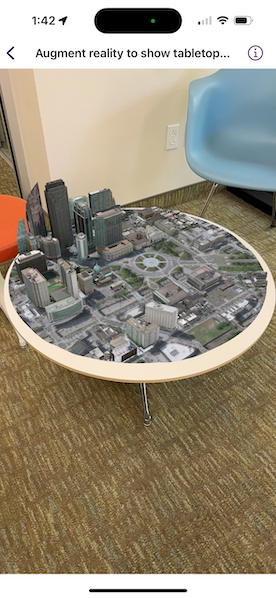

# Augment reality to show tabletop scene

Use augmented reality (AR) to pin a scene to a table or desk for easy exploration.

## Use case

Tabletop scenes allow you to use your device to interact with scenes as if they are 3D-printed models sitting on your desk. You could use this to virtually explore a proposed development without needing to create a physical model.

## How to use the sample

You'll see a feed from the camera when you open the sample. Tap on any flat, horizontal surface (like a desk or table) to place the scene. With the scene placed, you can move the camera around the scene to explore. You can also pan and zoom with touch to adjust the position of the scene.

## How it works

1. Create a `TableTopSceneView` with an anchor point, translation factor, clipping distance, and `SceneView`.
2. For this sample, the `anchorPoint` is set to the center of the scene for best results. This will give the impression that the scene is centered on the location the user tapped.
3. Set the `translationFactor` on the scene view such that the user can view the entire scene by moving the device around it. The translation factor defines how far the virtual camera moves when the physical camera moves.
    * A good formula for determining translation factor to use in a tabletop map experience is **translationFactor = sceneWidth / tableTopWidth**. The scene width is the width/length of the scene content you wish to display in meters. The tabletop width is the length of the area on the physical surface that you want the scene content to fill. For simplicity, the sample assumes a scene width of 800 meters.
4. Set the `clippingDistance` to clip the scene to the area you want to show.
5. Create a `SceneView` with a scene. To allow you to look at the content from below, set the base surface navigation constraint to `unconstrained`.

## Relevant API

* SceneView
* Surface
* TableTopSceneView

## Offline data

This sample uses offline data, available as an [item on ArcGIS Online](https://www.arcgis.com/home/item.html?id=7dd2f97bb007466ea939160d0de96a9d).

## About the data

This sample uses the [Philadelphia Mobile Scene Package](https://www.arcgis.com/home/item.html?id=7dd2f97bb007466ea939160d0de96a9d). It was chosen because it is a compact scene ideal for tabletop use. Note that tabletop mapping experiences work best with small, focused scenes. The small, focused area with basemap tiles defines a clear boundary for the scene.

## Additional information

**Tabletop AR** is one of three main patterns for working with geographic information in augmented reality. Augmented reality is made possible with the ArcGIS Maps SDK Toolkit.

## Tags

augmented reality, drop, mixed reality, model, pin, place, table-top, tabletop
