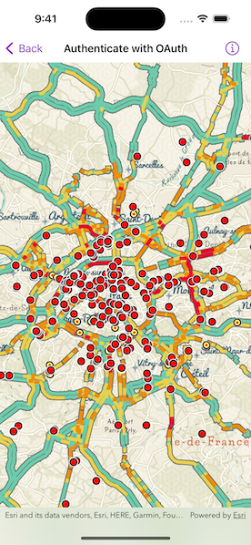

# Authenticate with OAuth

Authenticate with ArcGIS Online (or your own portal) using OAuth2 to access secured resources (such as private web maps or layers).

## Use case

Your app may need to access items that are only shared with authorized users. For example, your organization may host private data layers or feature services that are only accessible by verified users. You may also need to take advantage of premium ArcGIS Online services, such as geocoding or routing, that require a named user login.

## How to use the sample

Upon launch, a web map containing premium content will load. You will be prompted by an ArcGIS Online login to view the private layers. Enter a user name and password for an ArcGIS Online named user account (such as your ArcGIS Developer account). If you authenticate successfully, the traffic layer will display; otherwise, the map will contain only the public basemap layer.

## How it works

1. Create an `OAuthUserConfiguration` object specifying the portal URL, client ID, and redirect URL.
2. Create a toolkit component `Authenticator` object with OAuth user configuration.
3. Set authenticator object as ArcGIS and Network challenge handlers on authentication manager to handle authentication challenges.
4. Load a map with premium content requiring authentication.

## Relevant API

* AuthenticationManager
* Authenticator
* OAuthUserConfiguration
* Portal
* PortalItem

## Additional information

The workflow presented in this sample works for all SAML based enterprise (IWA, PKI, Okta, etc.) & social (Facebook, Google, etc.) identity providers for ArcGIS Online or Portal. For more information, see the topic [Set up enterprise logins](https://doc.arcgis.com/en/arcgis-online/administer/saml-logins.htm).

For additional information on using OAuth in your app, see the topic [OAuth 2.0](https://developers.arcgis.com/documentation/mapping-apis-and-services/security/oauth-2/) and [Serverless native and mobile app workflow](https://developers.arcgis.com/documentation/mapping-apis-and-services/security/user-authentication/serverless-native-flow/).

## Tags

authentication, cloud, credential, OAuth, portal, security
