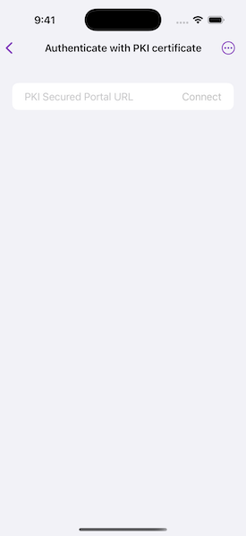

# Authenticate with PKI certificate

Access secured portals using a certificate.

## Use case

PKI (Public Key Infrastructure) is a certificate authentication method to secure resources without requiring users to remember passwords. Government agencies commonly issue smart cards using PKI to access computer systems.

## How to use the sample

1. Enter the URL to your PKI-secured portal.
2. Click the connect button to search for web maps stored on the portal.
3. You will be prompted to browse for a certificate.
4. If the certificate requires it you will be prompted for a password.
5. If you authenticate successfully, portal item results will display in the list.
6. Select a web map item to display it in the map view.

## How it works

1. The `AuthenticationManager` object is configured with a challenge handler that will prompt for a PKI certificate if a secure resource is encountered.
2. When a search for portal items is performed against a PKI-secured portal, the `Authenticator` creates a `NetworkCredential` from the information entered by the user.
3. If the user authenticates, the search returns a list of web maps (`PortalItem`) and the user can select one to display as a `Map`.

## Relevant API

* ArcGISEnvironment
* AuthenticationManager
* Authenticator
* Portal

## Additional information

ArcGIS Enterprise requires special configuration to enable support for PKI. See [Using Windows Active Directory and PKI to secure access to your portal](https://enterprise.arcgis.com/en/portal/latest/administer/windows/using-windows-active-directory-and-pki-to-secure-access-to-your-portal.htm) and [Use LDAP and PKI to secure access to your portal](https://enterprise.arcgis.com/en/portal/latest/administer/windows/use-ldap-and-pki-to-secure-access-to-your-portal.htm) in *Portal for ArcGIS*.

⚠ **NOTE**: Certificates installed on iOS are not available to user apps. Therefore, your app must take action to install the user's certificate into the app-specific keystore.

⚠ **WARNING**: Certificates sent to an iOS device over email will be opened by the default iOS apps (e.g. Safari) and installed in the device store. Name your certificates with an app-specific file extension and register your app as the handler for that extension. Then, when the user receives a certificate, your app can open that certificate and register it.

## Tags

authentication, certificate, login, passwordless, PKI, smartcard, store, X509
