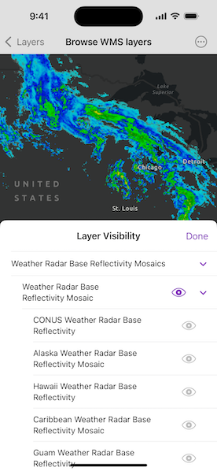

# Browse WMS layers

Connect to a WMS service and show the available layers and sublayers.

## Use case

WMS services often contain many layers and sublayers. Presenting the layers and sublayers in a UI allows you to explore what is available in the service and add individual layers to a map.

## How to use the sample

1. Open the sample.
2. Tap "Layer Visibility" to see a hierarchical list of layers and sublayers.
3. Select a layer to enable it for display. If the layer has any children, the children will also be selected.

## How it works

1. A `WMSService` is created and loaded.
2. `WMSService` has a `serviceInfo` property, which is a `WMSServiceInfo`. `WMSService` has a `WMSLayerInfo` object for each layer (excluding sublayers) in the `layerInfos` collection.
3. Models are recursively created for each sublayer.
    * The model has an `isVisible` property which sets the visibility for the associated sublayer.
4. Once the layer selection has been updated, a `WMSLayer` with the selected sublayers is created and added to the operational layers of the map.

## Relevant API

* WMSLayer
* WMSLayerInfo
* WMSService
* WMSServiceInfo

## About the data

This sample shows [forecasts guidance warnings](https://nowcoast.noaa.gov/geoserver/observations/weather_radar/wms?SERVICE=WMS&REQUEST=GetCapabilities) from an ArcGIS REST service produced by the US NOAA National Weather Service. The map shows fronts, highs, and lows, as well as areas of forecast precipitation.

## Tags

catalog, OGC, web map service, WMS
