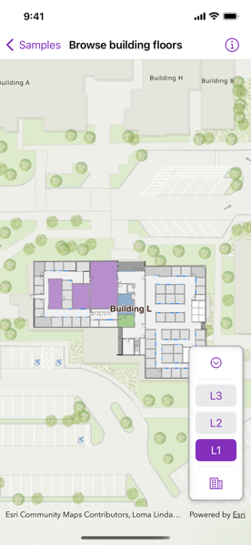

# Browse building floors

Display and browse through building floors from a floor-aware web map.

## Use case

Having map data to aid indoor navigation in buildings with multiple floors such as airports, museums, or offices can be incredibly useful. For example, you may wish to browse through all available floor maps for an office in order to find the location of an upcoming meeting in advance.

## How to use the sample

Use the picker to browse different floor levels in the facility. Only the selected floor will be displayed.

## How it works

1. Create and load a `Map` instance from a `PortalItem` of a floor-aware web map.
2. Create a `MapView` instance from the map.
3. Once the map is loaded, overlay a `FloorFilter` instance over the map view, specifying the map's floor manager, an alignment, the current viewpoint, and a Boolean value indicating whether the map is being navigated.

## Relevant API

* ArcGIS.FloorManager
* ArcGISToolkit.FloorFilter

## About the data

This sample uses a [floor-aware web map](https://www.arcgis.com/home/item.html?id=f133a698536f44c8884ad81f80b6cfc7) that displays the floors of Building L on the Esri Redlands campus.

## Additional information

The `FloorManager` API also supports browsing different sites and facilities in addition to building floors.

Floor-awareness APIs support both maps and scenes. To learn more about floor-aware maps, read the [Configure floor-aware maps](https://pro.arcgis.com/en/pro-app/latest/help/data/indoors/configure-floor-aware-maps.htm) article.

## Tags

building, facility, floor, floor-aware, floors, ground floor, indoor, level, site, story
