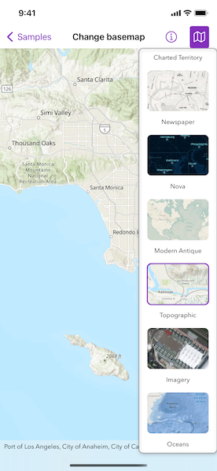

# Change basemap

Change a map's basemap. A basemap is beneath all the layers on a map and is used to provide a visual reference for the operational layers.

## Use case

Basemaps should be selected contextually. For example, in maritime applications, it would be more appropriate to use a basemap of the world's oceans as opposed to a basemap of the world's streets.

## How to use the sample

Tap the map button in the toolbar to view a list of the available basemaps. Tap an item to set it as the map's basemap.

## How it works

1. Create a `Map` object with the `arcGISImagery` basemap style.
2. Create a `MapView` instance with the map.
3. Create a `BasemapGallery` using the toolkit.

## Relevant API

* BasemapGallery
* BasemapStyle
* Map
* MapView

## Additional Information

This samples uses the basemap gallery toolkit component, which requires the [ArcGIS Runtime Toolkit for Swift](https://github.com/Esri/arcgis-runtime-toolkit-swift).

## Tags

basemap, map
