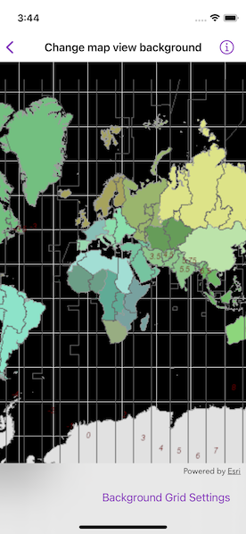

# Change map view background

Customize map view's background by changing its grid properties.

| ChangeMapViewBackground | Settings |
| ----------------- | ------------- |
|||

## Use case

Basemaps should be selected contextually. For example, in maritime applications, it would be more appropriate to use a basemap of the world's oceans as opposed to a basemap of the world's streets.

## How to use the sample

Tap the "Background Grid Settings" button in the toolbar to open the settings view. Tap the color next to "Color" and "Line Color" rows to change the background color and the grid's line color respectively. Use the sliders to change the grid line width and grid size.

## How it works

1. Create a `Map` object.
2. Display the map in a `MapView`.
3. Set the `backgroundGrid` property on the `MapView`.
4. Update the background grid properties from the settings view. The following `BackgroundGrid` properties are updated:
    * `backgroundColor`: fill color
    * `lineColor`: color of background grid lines
    * `lineWidth`: width (in points) of background grid lines
    * `size`: size (in points) of the background grid

## Relevant API

* BackgroundGrid
* Map
* MapView

## Tags

background, grid, map
