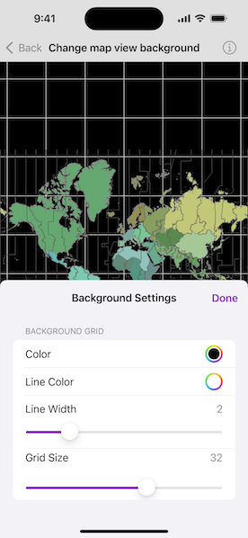

# Change map view background

Customize map view's background by changing its grid properties.

## Use case

A background grid defines the default color and grid for display behind a map or scene surface. Set properties on the background grid to highlight and give context to your map view or scene view.

## How to use the sample

Tap the "Background Grid Settings" button in the toolbar to open the settings view. Tap the color next to "Color" and "Line Color" rows to change the background color and the grid's line color respectively. Use the sliders to change the grid line width and grid size.

## How it works

1. Create a `Map` object.
2. Display the map in a `MapView`.
3. Set the `backgroundGrid` on the `MapView` using the view modifier.
4. Update the background grid properties from the settings view. The following `BackgroundGrid` properties are updated:
    * `backgroundColor`: fill color
    * `lineColor`: color of background grid lines
    * `lineWidth`: width (in points) of background grid lines
    * `size`: size (in points) of the background grid

## Relevant API

* BackgroundGrid
* Map
* MapView

## Tags

background, grid, map
