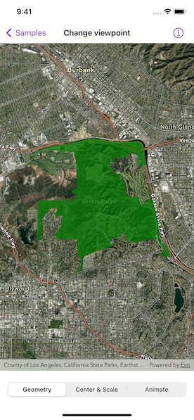
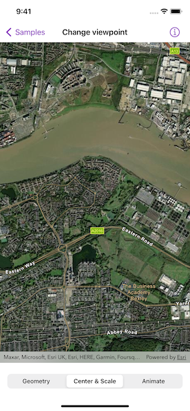

# Change viewpoint

Set the map view to a new viewpoint.

## Use case

Programmatically navigate to a specified location in the map or scene. Use this to focus on a particular point or area of interest.

## How to use the sample

The map view has several methods for setting its current viewpoint. Select a viewpoint from the UI to see the viewpoint changed using that method.

## How it works

1. Create a `Map` object and set it to the `MapView` object.
2. Change the map's viewpoint using one of the available methods:
    * Use `MapViewProxy.setViewpoint(_:duration:)` to pan to a viewpoint over the specified length of time.
    * Use `MapViewProxy.setViewpointCenter(_:scale:)` to center the viewpoint on an `Point` and set a distance from the ground using a scale.
    * Use `MapViewProxy.setViewpointGeometry(_:padding:)` to set the viewpoint to a given `Geometry`.

## Relevant API

* Geometry
* Map
* MapView
* Point
* Viewpoint

## Additional information

See the various "setViewpoint" methods on `MapViewProxy` and `SceneViewProxy` [here](https://developers.arcgis.com/swift/api-reference/documentation/arcgis/mapviewproxy/).

## Tags

animate, extent, pan, rotate, scale, view, zoom
