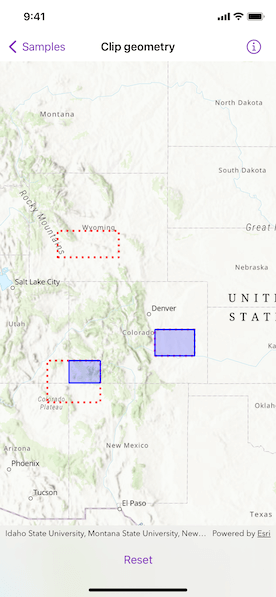

# Clip geometry

Clip a geometry with another geometry.

## Use case

Create a new set of geometries for analysis (e.g. displaying buffer zones around abandoned coal mine shafts in an area of planned urban development) by clipping intersecting geometries.

## How to use the sample

Tap the button to clip the blue graphic with the dotted red envelopes.

## How it works

1. Use the `static GeometryEngine.clip(_:to:)` method to generate a clipped `Geometry`, specifying an existing `Geometry` and an `Envelope` as parameters. The existing geometry will be clipped where it intersects an envelope.
2. Create a `Graphic` instance from the clipped geometry and add it to a `GraphicsOverlay`.

## Relevant API

* Envelope
* Geometry
* GeometryEngine
* Graphic
* GraphicsOverlay
* static GeometryEngine.clip(_:to:)

## Additional information

Note: the resulting geometry may be null if the envelope does not intersect the geometry being clipped.

## Tags

analysis, clip, geometry
