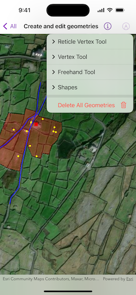

# Create and edit geometries

Use the Geometry Editor to create new point, multipoint, polyline, or polygon geometries or to edit existing geometries by interacting with a map view.

## Use case

A field worker can mark features of interest on a map using an appropriate geometry. Features such as sample or observation locations, fences or pipelines, and building footprints can be digitized using point, multipoint, polyline, and polygon geometry types. Polyline and polygon geometries can be created and edited using a vertex-based creation and editing tool (i.e. vertex locations specified explicitly via tapping), or using a freehand tool.

## How to use the sample

Tap the pencil button to choose a geometry editor tool. Begin interactively sketching on the map view. Tap the pencil button again for editing options.

## How it works

1. Create a `GeometryEditor` and assign it to a map view with the `geometryEditor` view modifier.
2. Set the tool of the geometry editor to the preferred tool.
3. Use the `start(withType:)` method on the `GeometryEditor` to start interactively sketching on the map view.
4. Use various methods and properties of the `GeometryEditor` to undo, redo, delete a selected element, clear the sketch, and cancel the sketch.
5. Edit a tool's `InteractionConfiguration` to set the `GeometryEditorScaleMode` to allow either uniform or stretch scale mode.
6. Save a sketch as a `Graphic` to a `GraphicsOverlay` displayed on the map view.

## Relevant API

* Geometry
* GeometryBuilder
* GeometryEditor
* Graphic
* GraphicsOverlay
* MapView

## Tags

draw, edit, freehand, geometry editor, sketch, vertex
