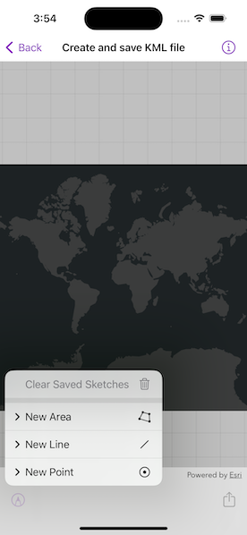
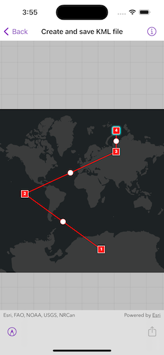

# Create and save KML file

Construct a KML document and save it as a KMZ file.

## Use case

If you need to create and save data on the fly, you can use KML to create points, lines, and polygons by sketching on the map, customizing the style, and serializing them as KML nodes in a KML Document. Once complete, you can share the KML data with others that are using a KML reading application, such as ArcGIS Earth.

## How to use the sample

Tap on the sketch button in the toolbar to add a new KML. Select a type of feature and choose its color or icon. Tap on the map to sketch the KML. Tap the sketch button and tap "Save Sketch" to complete the sketch. Tap the file export button in the toolbar to export the file. Tap the sketch button and the "Clear Saved Sketches" button to clear the current KML document.

## How it works

1. Create an `KMLDocument`.
2. Create an `KMLDataset` using the `KMLDocument`.
3. Create an `KMLLayer` using the `KMLDataset` and add it to the map's `operationalLayers` array.
4. Create `Geometry` using `GeometryEditor`.
5. Project that `Geometry` to WGS84 using `GeometryEngine.project(_:into:)`.
6. Create an `KMLGeometry` object using that projected `Geometry`.
7. Create an `KMLPlacemark` using the `KMLGeometry`.
8. Add the `KMLPlacemark` to the `KMLDocument`.
9. Set the `KMLStyle` for the `KMLPlacemark`.
10. When finished with adding `KMLPlacemark` nodes to the `KMLDocument`, save the `KMLDocument` to a file using the `KMLNode.save(to:)` method.

## Relevant API

* GeometryEditor
* GeometryEngine
* KMLDataset
* KMLDocument
* KMLGeometry
* KMLLayer
* KMLNode
* KMLPlacemark
* KMLStyle

## Tags

Keyhole, KML, KMZ, OGC
