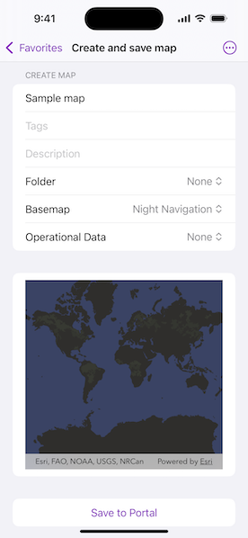

# Create and save map

Create and save a map as a web map item to an ArcGIS portal.

## Use case

Maps can be created programmatically in code and then serialized and saved as an ArcGIS portal item. In this case, the portal item is a web map which can be shared with others and opened in various applications and APIs throughout the platform, such as ArcGIS Pro, ArcGIS Online, the JavaScript API, and Field Maps.

## How to use the sample

When you run the sample, you will be challenged for an ArcGIS Online login. Enter a username and password for an ArcGIS Online named user account (such as your ArcGIS for Developers account). Then, choose the basemap and layers for your new map. To save the map, add a title, tags and description (optional), and a folder on your portal (you will need to create one in your portal's My Content section if you don't already have one). Click the Save button to save the map to the chosen folder.

## How it works

1. Setup the authenticator the manage authentication challenges.
2. Create a new `Portal` with an authenticated connection and load it.
3. Log in to the portal.
4. Access the `PortalUser.Content` with `portal.user.content`, to get the user's list of portal folders.
5. Create a `Map` with the specified `BasemapStyle` and operational data.
6. Call `Map.save(to:title:forceSaveToSupportedVersion:folder:description:thumbnail:tags:extent:)` to save the configured `Map` with the specified title, tags, description, and folder to the portal.

## Relevant API

* Map
* Portal
* BasemapStyle
* ArcGISMapImageLayer

## Tags

ArcGIS Online, ArcGIS Pro, portal, publish, share, web map
