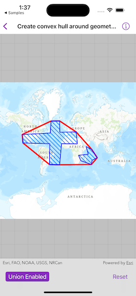

# Create convex hull around geometries

Generate convex hull polygon(s) from multiple input geometries.

## Use case

Creating a convex hull allows for analysis to define the polygon with the least possible perimeter that encloses a group of geometric shapes. As a visual analogy, consider a set of nails in a board where the convex hull is a rubber band stretched around the outermost nails.

## How to use the sample

Tap on the "Create" button to create convex hull(s) from the polygon graphics. If the "Union" toggle is on, the resulting output will be one polygon being the convex hull for the two input polygons. If the "Union" toggle is off, the resulting output will have two convex hull polygons - one for each of the two input polygons. Tap "Reset" to start over and remove the convex hull(s).

## How it works

1. Create an `Map` and display it in a `MapView`.
2. Create two input polygon graphics and add them to a `GraphicsOverlay`.
3. Call `GeometryEngine.convexHull(for:shouldMerge:)`, specifying a list of geometries for which to generate the convex hull. Set the `shouldMerge:` parameter to `true` to generate a convex hull for the union of the geometries. Set it to `false` to create a convex hull for each individual geometry.
4. Loop through the returned geometries and add them to a Graphics Overlay to display on the map.

## Relevant API

* GeometryEngine
* GraphicsOverlay

## Tags

analysis, geometry, outline, perimeter, union
