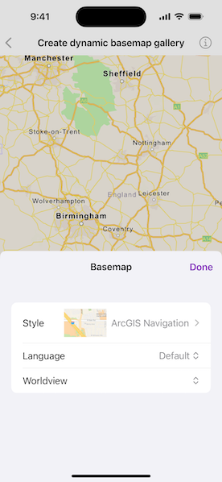

# Create dynamic basemap gallery

Implement a basemap gallery that automatically retrieves the latest customization options from the basemap styles service.

## Use case

Multi-use and/or international applications benefit from the ability to change a basemap's style or localize the basemap. For example, an application used for ecological surveys might include navigation functionality to guide an ecologist to a location and functionality for inputting data. When traveling, a user is likely to benefit from a map with a style that emphasizes the transport infrastructure (e.g., `ArcGIS Navigation`). However, during surveys a user is likely to benefit from a map with a style that highlights features in the terrain (e.g. `ArcGIS Terrain`). Implementing a basemap gallery with customization options in an application gives a user the freedom to select a basemap with a style and features (e.g., the language of labels) suitable for the task they are undertaking. Making the basemap gallery dynamic ensures the latest customization options are automatically included.

## How to use the sample

Press "Basemap" to display a gallery of all styles available in the basemap styles service. Select a style using the "Style" picker. Select a language or language strategy using the "Language" picker. Optionally selected a worldview using the "Worldview" picker. Disabled pickers indicate that the customization cannot be applied to the selected style.

## How it works

* Create and load a `BasemapStylesService` object.
* Get the `BasemapStylesServiceInfo` object from `BasemapStylesService.info`.
* Access the list of `BasemapStyleInfo` objects using `BasemapStylesServiceInfo.stylesInfo`. These `BasemapStyleInfo` objects contain up-to-date information about each of the styles supported by the Maps SDK, including:
    * `languageStrategies`: A list of `BasemapStyleLanguageStrategy` enumeration values that can be used with the style.
    * `languages`: A list of `Locale.Language` objects that can be used to customize labels on the style.
    * `styleName`: The human-readable name of the style.
    * `style`: The `Basemap.Style` enumeration value representing this style in the Maps SDK.
    * `thumbnail`: An image that can be used to display a preview of the style.
    * `worldview`: A list of `Worldview` objects, which provide information about each representation of a disputed boundary that can be used to customize boundaries on the style.
* The information contained in the list of `BasemapStyleInfo` objects can be used as the data model for a basemap gallery UI component.

## Relevant API

* BasemapStyleInfo
* BasemapStyleLanguageInfo
* BasemapStyleParameters
* BasemapStylesService
* BasemapStylesServiceInfo
* Worldview

## Additional information

This sample demonstrates how to implement a basemap gallery using the Maps SDK. The styles and associated customization options used for the gallery are retrieved from the [basemap styles service](https://developers.arcgis.com/rest/basemap-styles/). A ready-made basemap gallery component is also available in the toolkits provided with each SDK. To see how the ready-made basemap gallery toolkit component can be integrated into a Maps SDK application, refer to the `Set Basemap` sample.

## Tags

basemap, languages, service, style
