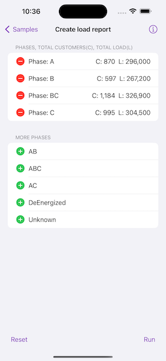

# Create load report

Create a simple electric distribution report that displays the count of customers and total load per phase by tracing downstream from a given point.

## Use case

You can use a load report to display the customers per phase as well as the load per phase based on a chosen starting point in a utility network. Load reports are used for electric load restoration and balancing.

## How to use the sample

Choose phases to be included in the report. Tap "Run" to initiate a downstream trace on the network and create a load report.

## How it works

1. Create and load a `UtilityNetwork` with a feature service URL, then get an asset type, tier, network attributes, and category by their names.
2. Create a `UtilityElement` from the asset type to use as the starting location for the trace.
3. Get a base condition by calling the utility tier's `makeDefaultTraceConfiguration` method.
4. Create `UtilityTraceParameters` passing in `downstream` trace type and the default starting location. Set its `traceConfiguration` property with the trace configuration above, and set `includesBarriers` to `false`.
5. Create a `UtilityCategoryComparison` where "ServicePoint" category exists.
6. Reset the `functions` property of the trace configuration with a new `UtilityTraceFunction` adding a "Service Load" network attribute where this category comparison applies. This will limit the function results.
7. Set `outputCondition` with this category comparison to limit the element results.
8. Populate the choice list for phases using the network attribute's `codedValues` property.
9. When the "Add" button is tapped, add the selected phase to a phases list.
10. When the "Run" button is tapped, run a trace for every `CodedValue` in the phases list. Do this by creating an `UtilityTraceOrCondition` with the base condition and an `UtilityNetworkAttributeComparison` where the "Phases Current" network attribute does not include the coded value.
11. Display the count of "Total Customers" using the `elements` property of the result, and the result of "Total Load" using the first and only output in `functionOutputs` property.

## Relevant API

* UtilityAssetType
* UtilityCategoryComparison
* UtilityDomainNetwork
* UtilityElement
* UtilityElementTraceResult
* UtilityNetwork
* UtilityNetworkAttribute
* UtilityNetworkAttributeComparison
* UtilityNetworkDefinition
* UtilityNetworkSource
* UtilityTerminal
* UtilityTier
* UtilityTraceConfiguration
* UtilityTraceFunction
* UtilityTraceParameters
* UtilityTraceResult
* UtilityTraceType
* UtilityTraversability

## Tags

condition barriers, downstream trace, network analysis, subnetwork trace, trace configuration, traversability, upstream trace, utility network, validate consistency
