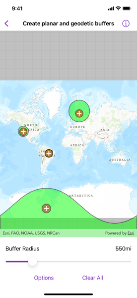

# Create planar and geodetic buffers

Create a planar and geodetic buffer around a map point and display the results as a graphic.

## Use case

Creating buffers is a core concept in GIS proximity analysis that allows you to visualize and locate geographic features contained within a polygon. For example, suppose you wanted to visualize areas of your city where alcohol sales are prohibited because they are within 500 meters of a school. The first step in this proximity analysis would be to generate 500 meter buffer polygons around all schools in the city. Any such businesses you find inside one of the resulting polygons are violating the law.

## How to use the sample

1. Tap on the map.
2. A planar and a geodetic buffer will be created at the tap location using the distance (miles) specified in the options menu.
3. Continue tapping to create additional buffers. Notice that buffers closer to the equator appear similar in size. As you move north or south from the equator, however, the geodetic polygons become much larger. Geodetic polygons are in fact a better representation of the true shape and size of the buffer.
4. Tap *Clear All* to remove all buffers and start again.

## How it works

1. Create graphics overlays for each overlay.
2. Use the `onSingleTapGesture()` modifier to capture the map `Point`.
3. Use the static methods `GeometryEngine.geodeticBuffer(around:distance:distanceUnit:maxDeviation:curveType:)` and `GeometryEngine.buffer(around:distance:)` to create a geodetic and a planar buffer polygon from the map location and distance.
4. Create and add a `Graphic` instance to the respective overlay.
5. Display a `MapView` with the graphics overlays.

## Relevant API

* Graphic
* GraphicsOverlay
* static GeometryEngine.buffer(around:distance:)
* static GeometryEngine.geodeticBuffer(around:distance:distanceUnit:maxDeviation:curveType:)

## Additional information

The polygon results (and tap location) are displayed in the map view with different symbols in order to highlight the difference between the buffer techniques due to the spatial reference used in the planar calculation.

Buffers can be generated as either *planar* (flat - coordinate space of the map's spatial reference) or *geodetic* (technique that considers the curved shape of the Earth's surface, which is generally a more accurate representation). In general, distortion in the map increases as you move away from the standard parallels of the spatial reference's projection. This map is in Web Mercator, so areas near the equator are the most accurate. As you move the buffer location north or south from that line, you'll see a greater difference in the polygon size and shape. Planar operations are generally faster, but performance improvement may only be noticeable for large operations (buffering a great number or complex geometry).

For more information about using buffer analysis, see the topic [How Buffer (Analysis) works](https://pro.arcgis.com/en/pro-app/tool-reference/analysis/how-buffer-analysis-works.htm) in the *ArcGIS Pro* documentation.  

## Tags

analysis, buffer, euclidean, geodetic, geometry, planar
