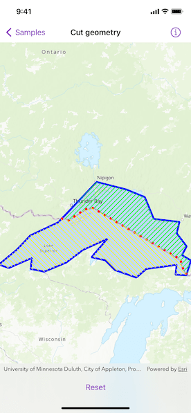

# Cut geometry

Cut a geometry along a polyline.

## Use case

You might cut a polygon representing a large parcel to subdivide it into smaller parcels.

## How to use the sample

Tap the button to cut the polygon with the polyline and see the resulting parts (shaded in different colors).

## How it works

1. Pass a `Geometry` and a `Polyline` to the `static GeometryEngine.cut(_:usingCutter:)` method to cut the geometry along the given polyline.
2. Loop through the returned list of part geometries. Some geometries may be multi-part.
3. Create a `Graphic` instance from the part and add it to a `GraphicsOverlay`.

## Relevant API

* Geometry
* GeometryEngine
* Graphic
* GraphicsOverlay
* Polygon
* Polyline
* static GeometryEngine.cut(_:usingCutter:)

## Tags

cut, geometry, split
