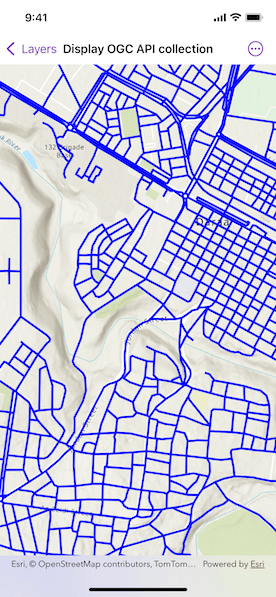

# Display OGC API collection

Display an OGC API feature collection and query features while navigating the map view.

## Use case

When panning the map view, it may be necessary to query the OGC API feature table for additional features within the new visible extent.

## How to use the sample

Pan the map and see how new features are loaded from the OGC API feature service.

## How it works

1. Create an `OGCFeatureCollectionTable` object using a URL to an OGC API feature service and a collection ID.
2. Set the feature table's `featureRequestMode` property to `manualCache`.
3. Create an `FeatureLayer` using the feature table and add it to the map view.
4. Create a default `QueryParameters` object.
    * Set the parameter's `spatialRelationship` property to `intersects`.
    * Set the `maxFeatures` property to `5_000` (some services have a low default value for maximum features).
5. Every time the map view navigation completes:
    * Set the parameter's `geometry` to the current extent of the map view.
    * Call `OGCFeatureCollectionTable.populateFromService(using:clearCache:outFields:queryLanguage:)` using the query parameters.

## Relevant API

* OGCFeatureCollectionTable
* QueryParameters

## About the data

The [Daraa, Syria test data](https://demo.ldproxy.net/daraa) is OpenStreetMap data converted to the Topographic Data Store schema of NGA.

## Additional information

See the [OGC API website](https://ogcapi.ogc.org/) for more information on the OGC API family of standards.

## Tags

feature, feature layer, feature table, OGC, OGC API, service, table, web
