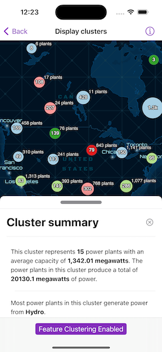

# Display clusters

Display a web map with a point feature layer that has feature reduction enabled to aggregate points into clusters.

## Use case

Feature clustering can be used to dynamically aggregate groups of points that are within proximity of each other in order to represent each group with a single symbol. Such grouping allows you to see patterns in the data that are difficult to visualize when a layer contains hundreds or thousands of points that overlap and cover each other.

## How to use the sample

Pan and zoom the map to view how clustering is dynamically updated. Toggle clustering off to view the original point features that make up the clustered elements. When clustering is toggled on, you can tap on a clustered geoelement to view aggregated information and summary statistics for that cluster as well as a list of containing geoelements. When clustering is disabled and you tap on the original feature you get access to information about individual power plant features.

## How it works

1. Create a map from a web map `PortalItem`.
2. Get the cluster enabled layer from the map's operational layers.
3. Get the `FeatureReduction` from the feature layer and set `isEnabled` to enable or disable clustering on the feature layer.
4. Use the `onSingleTapGesture` modifier to listen for tap events on the map view.
5. Identify tapped features on the map using `identify(on:screenPoint:tolerance:returnPopupsOnly:maximumResults:)` on the feature layer and pass in the map screen point location.
6. Get the `Popup` from the resulting `IdentifyLayerResult` and use it to construct a `PopupView`.
7. Get the `AggregateGeoElement` from the `IdentifyLayerResult` and use `geoElements` to retrieve the contained `GeoElement` objects.
8. Use a `FloatingPanel` to display the popup information from the `PopupView` and the list containing the `GeoElement` objects.

## Relevant API

* AggregateGeoElement
* FeatureLayer
* FeatureReduction
* GeoElement
* IdentifyLayerResult

## About the data

This sample uses a [web map](https://www.arcgis.com/home/item.html?id=8916d50c44c746c1aafae001552bad23) that displays the [Esri Global Power Plants](https://www.arcgis.com/home/item.html?id=eb54b44c65b846cca12914b87b315169) feature layer with feature reduction enabled. When enabled, the cluster's symbology shows the color of the most common power plant type, and a size relative to the average plant capacity of the cluster.

## Tags

aggregate, bin, cluster, group, merge, normalize, reduce, summarize
