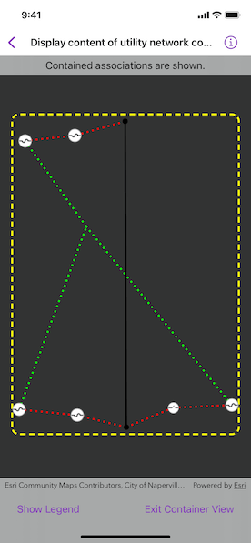

# Display content of utility network container

A utility network container allows a dense collection of features to be represented by a single feature, which can be used to reduce map clutter.

## Use case

Offering a container view for features aids in the review for valid, structural attachment, and containment relationships. It also helps determine if a dataset has an association role set. Container views often model a cluster of electrical devices on a pole top or inside a cabinet or vault.

## How to use the sample

Tap a container feature to show all features inside the container. The container is shown as a polygon graphic with the content features contained within. The viewpoint and scale of the map are also changed to the container's extent. Connectivity and attachment associations inside the container are shown as dotted lines.

## How it works

1. Create and load a web map that includes ArcGIS Pro [Subtype Group Layers](https://pro.arcgis.com/en/pro-app/help/mapping/layer-properties/subtype-layers.htm) with only container features visible (i.e. fuse bank, switch bank, transformer bank, hand hole, and junction box).
2. Create a `MapView` and add the `onSingleTapGesture(perform:)` modifier to detect tap events.
3. Get and load the first `UtilityNetwork` from the web map.
4. Add a `GraphicsOverlay` for displaying a container view.
5. Identify the tapped feature and create an `UtilityElement` from it.
6. Get the associations for this element using `UtilityNetwork.associations(for:ofKind:)`.
7. Turn-off the visibility of all of the map's `operationalLayers`.
8. Get the features for the `UtilityElement`(s) from the associations using `UtilityNetwork.features(for:)`.
9. Add a `Graphic` with the same geometry and symbol as these features.
10. Add another `Graphic` that represents this extent and zoom to this extent with some buffer.
11. Get associations for this extent using `UtilityNetwork.associations(forExtent:ofKind:)`.
12. Add a `Graphic` to represent the association geometry between them using a symbol that distinguishes between `attachment` and `connectivity` association type.
13. Turn-on the visibility of all `operationalLayers`, clear the `Graphic` objects, and zoom out to previous extent to exit container view.

## Relevant API

* SubtypeFeatureLayer
* UtilityAssociation
* UtilityAssociation.Kind
* UtilityElement
* UtilityNetwork

## About the data

The [Naperville Electric SubtypeGroupLayers with Containers](https://sampleserver7.arcgisonline.com/portal/home/item.html?id=0e38e82729f942a19e937b31bfac1b8d) web map contains a utility network used to find associations shown in this sample. Authentication is required and handled within the sample code.

## Tags

associations, connectivity association, containment association, structural attachment associations, utility network
