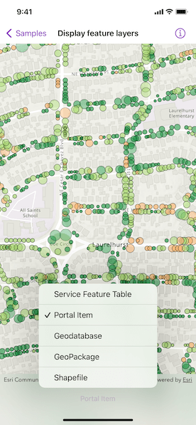

# Display feature layers

Display feature layers from various data sources.

## Use case

Feature layers, like all other layers, are visual representations of data and are used on a map or scene. In the case of feature layers, the underlying data is held in a feature table or feature service.

Feature services are useful for sharing vector GIS data with clients so that individual features can be queried, displayed, and edited. There are various online and offline methods to load feature services.

## How to use the sample

Tap the button on the toolbar to add feature layers, from different sources, to the map. Pan and zoom the map to view the feature layers.

## How it works

1. Create a `Map` instance with a topographic basemap style.
2. Load a feature layer with a feature table.
    i. Create a `ServiceFeatureTable` instance from a URL.
    ii. Create a `FeatureLayer` instance with the feature table.
3. Load a feature layer with a portal item.
    i. Create a `FeatureLayer` instance with a portal item.
4. Load a feature layer with a geodatabase.
    i. Instantiate and load a `Geodatabase` using the file name.
    ii. Get the feature table from the geodatabase with the feature table's name by using the `getGeodatabaseFeatureTable(tableName:)` geodatabase method.
    iii. Create a `FeatureLayer` instance from the feature table.
5. Load a feature layer with a GeoPackage.
    i. Instantiate and load a GeoPackage using its file name.
    ii. Get the first `GeoPackageFeatureTable` from the `geoPackageFeatureTables` array.
    iii. Create a `FeatureLayer` instance from the feature table.
6. Load a feature layer with a shapefile.
    i. Create a `ShapefileFeatureTable` instance using the shapefile name.
    ii. Create a `FeatureLayer` instance from the feature table.
7. Add the feature layer to the map's operational layers.
8. Create a `MapView` instance with the map.

## Relevant API

* FeatureLayer
* Geodatabase
* GeoPackage
* PortalItem
* ServiceFeatureTable
* ShapefileFeatureTable

## About the data

This sample uses the [Naperville damage assessment service](https://sampleserver7.arcgisonline.com/server/rest/services/DamageAssessment/FeatureServer/0), [Trees of Portland portal item](https://www.arcgis.com/home/item.html?id=1759fd3e8a324358a0c58d9a687a8578), [Los Angeles Trailheads geodatabase](https://www.arcgis.com/home/item.html?id=2b0f9e17105847809dfeb04e3cad69e0), [Aurora, Colorado GeoPackage](https://www.arcgis.com/home/item.html?id=68ec42517cdd439e81b036210483e8e7), and [Scottish Wildlife Trust Reserves Shapefile](https://www.arcgis.com/home/item.html?id=15a7cbd3af1e47cfa5d2c6b93dc44fc2).

The Scottish Wildlife Trust shapefile data is provided from Scottish Wildlife Trust under [CC-BY license](https://creativecommons.org/licenses/by/4.0/). Data © Scottish Wildlife Trust (2022).

## Tags

feature, geodatabase, geopackage, layers, service, shapefile, table