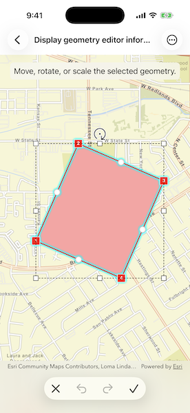

# Display geometry editor information during interaction

Use the geometry editor to see information about the geometry editor's previewed geometry during an editing interaction.

## Use case

The geometry editor can provide information about the geometry being created or edited during an interaction. This information can be used to give feedback to the user to show the effect of the interaction on the geometry.

## How to use the sample

Tap a graphic to edit its geometry by moving, rotating, or scaling the geometry. During the interaction, information about the geometry will be displayed to provide feedback to the user.

Use the buttons in the settings view to undo or redo changes made to the geometry and the cancel and done buttons to discard and save changes, respectively.

## How it works

1. Create a `GeometryEditor` and pass it to the map view's `geometryEditor(_:)` modifier.
2. Iterate over the `geometryEditor.interactionPreviews` asynchronous stream to receive a `GeometryEditorInteractionPreview` during an interaction.
    * The preview's `geometry` property represents the geometry's state at that moment.
    * The `interactionType` property identifies the type of interaction that is occurring (`create`, `move`, `rotate`, or `scale`).
    * The `interactionElement` property identifies the element being interacted with, such as a `GeometryEditorVertex`, `GeometryEditorPart`, or `GeometryEditorGeometry`.
3. Start the `GeometryEditor` using `geometryEditor.start(withInitial: geometry)` to edit the geometry of an identified `Graphic`.
    * To identify the `Graphic`, use `MapViewProxy.identify(on:screenPoint:tolerance:)` and get the first result.
4. Check whether undo and redo are possible during an editing session using `geometryEditor.canUndo` and `geometryEditor.canRedo`. Use `geometryEditor.undo()` and `geometryEditor.redo()` to undo and redo edits.
5. Call `geometryEditor.stop()` to finish the editing session and store the `Graphic`. The `GeometryEditor` does not automatically handle the visualization of a geometry output from an editing session. This must be done manually by propagating the geometry returned into a `Graphic` added to a `GraphicsOverlay`.
    * To update the geometry underlying an existing `Graphic` in the `GraphicsOverlay`:
        * Replace the existing `Graphic`'s `geometry` property with the geometry returned by `geometryEditor.stop()`.

## Relevant API

* Geometry
* GeometryEditor
* GeometryEditor.interactionPreviews
* GeometryEditorInteractionPreview
* GeometryEditorInteractionType
* Graphic
* GraphicsOverlay

## Additional information

The `geometryEditor.interactionPreviews` stream emits continuously during an interaction, so it is not recommended to use it as a trigger for resource-intensive actions.

## Tags

draw, edit, geometry editor, interaction preview
