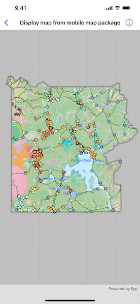

# Display map from mobile map package

Display a map from a mobile map package.

## Use case

An .mmpk file is an archive containing the data (specifically, basemaps and features) used to display an offline map.

## How to use the sample

The sample displays the map in the mobile map package. Pan and zoom to observe the data from the mobile map package.

## How it works

1. Create a `MobileMapPackage` instance, specifying the path to the .mmpk file.
2. Asynchronously load the mobile map package.
3. After it successfully loads, get the map from the mobile map package and update the map view's map with it.

## Relevant API

* MapView
* MobileMapPackage

## About the data

This sample shows points of interest within a [Yellowstone Mobile Map Package](https://www.arcgis.com/home/item.html?id=e1f3a7254cb845b09450f54937c16061) hosted on ArcGIS Online.

## Tags

mmpk, mobile map package, offline
