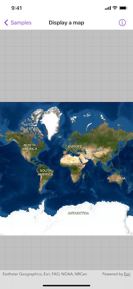

# Display map

Display a map with an imagery basemap.

## Use case

The map is the fundamental building block of any GIS application and is used to specify how geographic data is organized and communicated to your users.

## How to use the sample

When loaded, the sample will display a map. Pan and zoom to explore the map.

## How it works

1. Create a `Map` object with the `arcGISImagery` basemap style.
2. Create a `MapView` instance with the map.

## Relevant API

* BasemapStyle
* Map
* MapView

## Tags

basemap style, map
