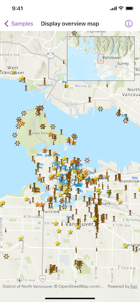

# Display overview map

Include an overview or inset map as an additional map view to show the wider context of the primary view.

## Use case

An overview map provides a useful, smaller-scale overview of the current map view's location. For example, when you need to inspect a layer with many features while remaining aware of the wider context of the view, use an overview map to help show the extent of the main map view.

## How to use the sample

Pan or zoom across the map view to browse through the tourist attractions feature layer and watch the viewpoint or scale of the linked overview map update automatically.

## How it works

1. Create a `Map` with the `arcGISTopographic` basemap style.
2. Create a `MapView` instance with the map.
3. Instantiate a `FeatureLayer` and add it to the map's operational layers.
4. Create an `OverviewMap` object using the toolkit.
5. Add the `OverviewMap` to the map view as an overlay.

## Relevant API

* MapView
* OverviewMap

## About the data

The data used in this sample is the [OpenStreetMap Tourist Attractions for North America](https://www.arcgis.com/home/item.html?id=97ceed5cfc984b4399e23888f6252856) feature layer, which is scale-dependent and displays at scales larger than 1:160,000.

## Additional information

This sample uses the overview map toolkit component, which requires the [ArcGIS Maps SDK for Swift Toolkit](https://github.com/ArcGIS/arcgis-maps-sdk-swift-toolkit).

## Tags

context, inset, map, minimap, overview, preview, small scale, toolkit, view
