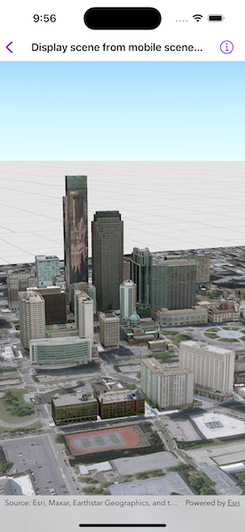

# Display scene from mobile scene package

Opens and displays a scene from a Mobile Scene Package (.mspk).

## Use case

An .mspk file is an archive containing the data (specifically, basemaps and features), used to display an offline 3D scene.

## How to use the sample

When the sample opens, it will automatically display the Scene in the Mobile Map Package.

## How it works

This sample takes a Mobile Scene Package that was created in ArcGIS Pro, and displays a `Scene` from within the package in a `SceneView`.

1. Create a `MobileScenePackage` using the path to the local .mspk file.
2. Call `MobileScenePackage.load()` and check for any errors.
3. When the `MobileScenePackage` is loaded, obtain the first `Scene` from the `MobileScenePackage.scenes` property.
4. Create a `SceneView` by passing in the scene.

## Relevant API

* MobileScenePackage
* SceneView

## Offline data

This mobile scene package was authored with ArcGIS Pro. It is downloaded from ArcGIS Online automatically.

[This item is available on ArcGIS Online](https://www.arcgis.com/home/item.html?id=7dd2f97bb007466ea939160d0de96a9d).

## Tags

offline, scene
